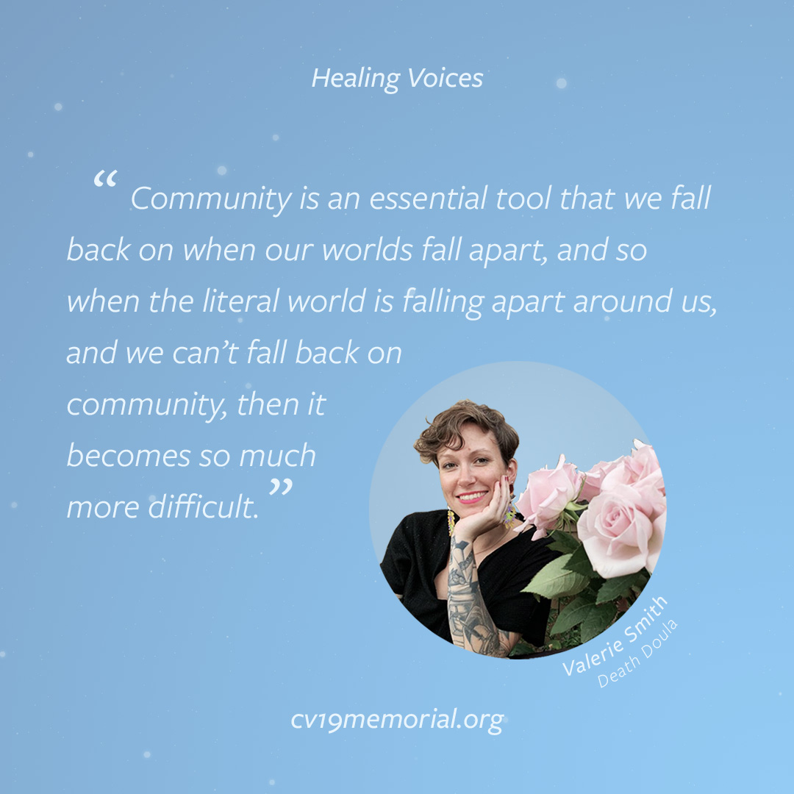

  
## Valerie Smith  
On Monday April 27th 2020, we spoke with Valerie Smith. Valerie is an Interfaith Reverend-in-training, a certified Death Doula, and the creator behind Your Neighborhood Death Doula, an audio guide to death and grieving in isolation and pandemic — with weekly talks, meditations, art and writing prompts, rituals, poetry, and questions for navigating loss during Covid-19.

April 12, 2020

[Listen to interview](/valerie-smith)

