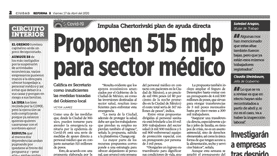
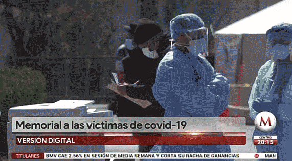
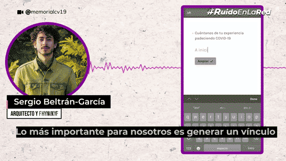
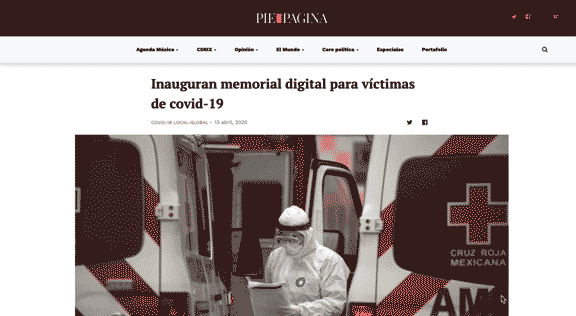

  
## Creating Historic Memory 
Reforma, a top Mexican newspaper, published in its digital and printed versions a story on cv19memorial

April 17, 2020

[Link to article (in Spanish)](https://www.reforma.com/libre/acceso/accesofb.htm?urlredirect=/crean-memoria-historica/ar1921632?utm_source=twitter&utm_medium=social&utm_campaign=robotgr&utm_content=@reformaciudad)  

  
## Mileno TV Interview
Mexican national television broadcasted cv19memorial's mission and story.

April 15, 2020

[Link to article (in Spanish)](https://www.milenio.com/politica/comunidad/crean-memorial-virtual-compartir-experiencias-covid-19)  

## RuidoEnLaRed Interview 
RuidoEnLaRed, a digital-first news organization made a fantastic video explaining what cv19memorial is.

April 14, 2020

[Link to interview (in Spanish)](https://www.youtube.com/watch?v=NSaW0fuOjOc)

  
## Article on PieDePágina
An article on the award-winning Mexican media outlet, PieDePágina

April 13, 2020  

[Link to article (in Spanish)](https://piedepagina.mx/inauguran-memorial-digital-para-victimas-de-covid-19/)
