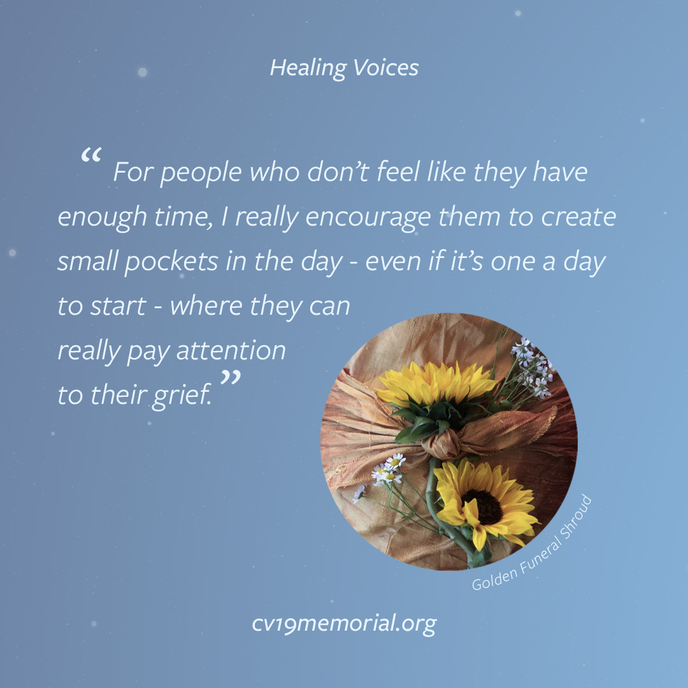
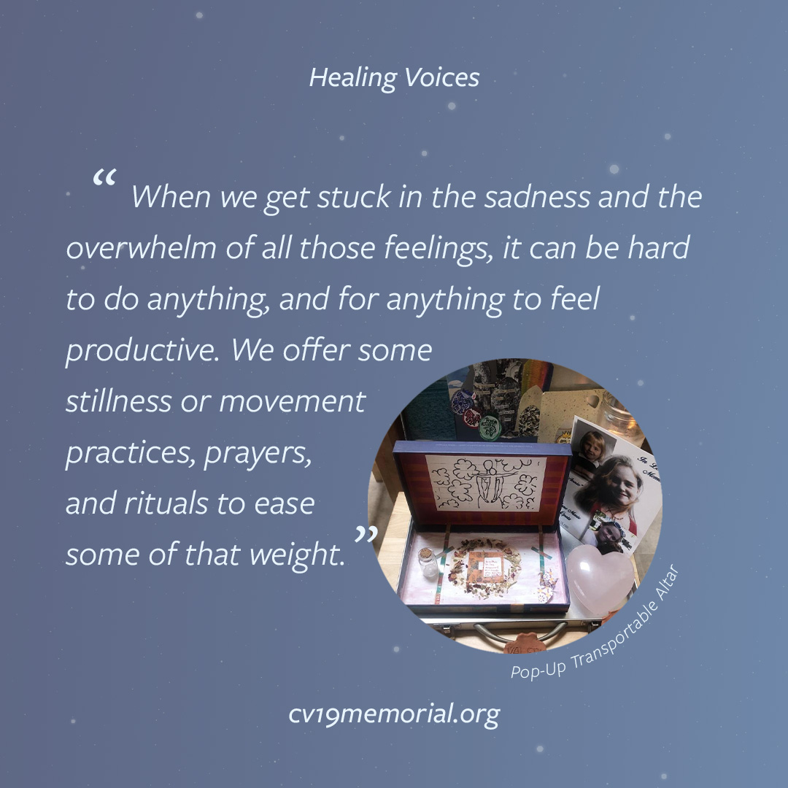

# Valerie Smith 
April 27, 2020

On Monday April 27th 2020, we spoke with Valerie Smith. Valerie is an Interfaith Reverend-in-training, a certified Death Doula, and the creator behind Your Neighborhood Death Doula, an audio guide to death and grieving in isolation and pandemic — with weekly talks, meditations, art and writing prompts, rituals, poetry, and questions for navigating loss during Covid-19.

<audio controls>
  <source src="../audio/Valerie_Smith_4_27_20_full_interview02.mp3" type="audio/mpeg">
  Your browser does not support the audio tag.
</audio>

  
    